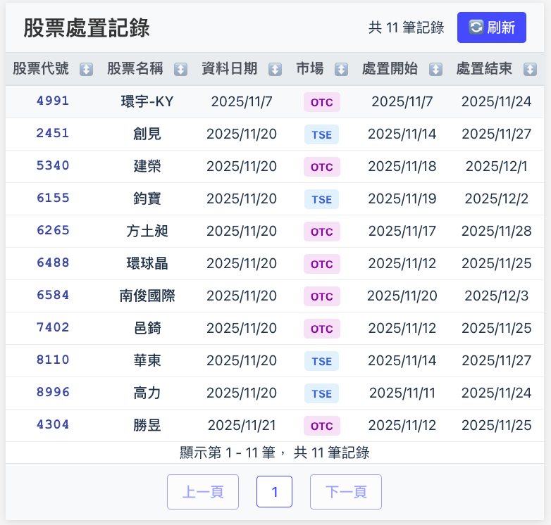

# React for Rust + mysql + API


## data schema
```rust
pub struct Disposition {
    pub stock_date: Option<NaiveDate>,
    pub market: String,
    pub symbol: i32,
    pub name: String,
    pub start: Option<NaiveDate>,
    pub end: Option<NaiveDate>,
    pub created_at: Option<NaiveDateTime>,
    pub updated_at: Option<NaiveDateTime>,
}
```